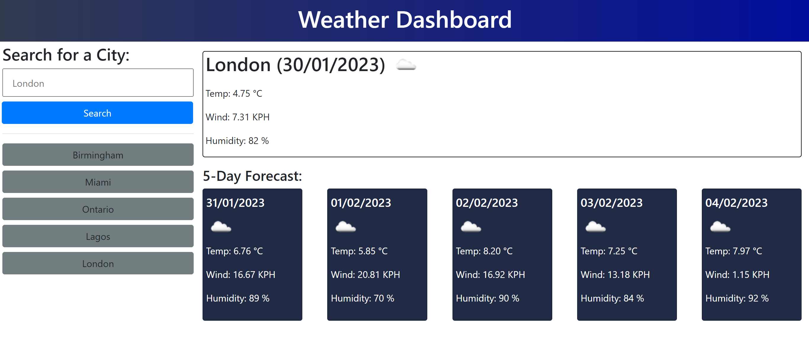

# Weather Dashboard -OT

## Description 

### User Story

```
AS A traveler
I WANT to see the weather outlook for multiple cities
SO THAT I can plan a trip accordingly
```

### Acceptance Criteria

```
* The weather dashboard consist of an input form which collects the name of the city.

* The current and future weather conditions is displayed for the city user searched for.

* When a user views the current weather conditions for a city, the following information is displayed:
  * City name
  * Date
  * An icon representation of weather conditions
  * Temperature (°C)
  * Humidity (%)
  * Wind speed (KPH)

* When a user views future weather conditions for that city they are presented with a 5-day forecast that displays the following information:
  * Date
  * An icon representation of weather conditions
  * Temperature (°C)
  * Humidity (%)
  * Wind speed (KPH)

* When a user clicks on a city in the search history they are again presented with current and future conditions for that city
```

## Table of Contents

* [Description](#description)
* [Usage](#usage)
* [Credits](#credits)
* [License](#license)

## Usage 

### Deployed Application

* The URL of the deployed application:
[https://thorbieey.github.io/Day-Scheduler/](https://thorbieey.github.io/Day-Scheduler/)

* The URL of the GitHub repository: 
[https://github.com/Thorbieey/Day-Scheduler.git](https://github.com/Thorbieey/Day-Scheduler.git)

#### Screenshots/Demo



## Credits

* [Play with HTML colours](https://htmlcolorcodes.com/)

* [Retrieve geographical coordinates for any city in the world](https://openweathermap.org/api/geocoding-api)

* [Retrieve weather data for any city in world](https://openweathermap.org/forecast5)

* [Meet jQuery method: **reverse()**](https://developer.mozilla.org/en-US/docs/Web/JavaScript/Reference/Global_Objects/Array/reverse)

* [Explore JavaScript's Set()](https://developer.mozilla.org/en-US/docs/Web/JavaScript/Reference/Global_Objects/Set#examples)

* Wanna check out cool options for removing duplicate items from your array? [Stack Overflow has you covered](https://stackoverflow.com/questions/9229645/remove-duplicate-values-from-js-array)

## License

Licensed under the [MIT](https://choosealicense.com/licenses/mit/) license
